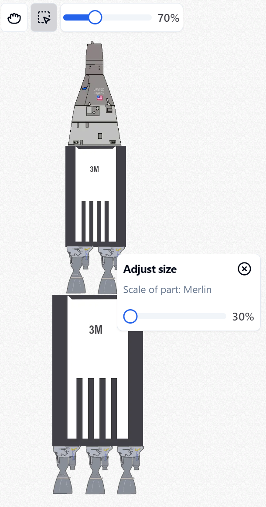

## Rocket building webapp, based on nextJs

Build a rocket from parts, orgonize stages, view performance details, 2D plots, 3D trajectory. Configure flight parameters, such as heading, simulation length, climb rate.

### [Working demo](https://project-gemini-next.vercel.app)

## Getting Started

Some versions of zod, might not work with prisma-zod-generator.

Working config: next@13.5.5 zod@3.21.1 prisma-zod-generator@0.8.13

    npm install

Create .env file, paste the following:

-   generated auth credentials from [kinde.com](https://kinde.com/) (for authentication)
-   a DATABASE_URL (for prisma)
-   firebase admin credentials (for uploading rocket previews)

## Simulation accuracy

**The simulation uses a simplified model, for the rocket as well as other forces acting on it.**

The flight trajectory is calculated in 2D then projected to the 3D globe. I used the Ruggen-Kutta 4th order method to calculate the flight path.

The change in air density, and velocity for the drag force, and the altitude for the gravitational force is taken into a count.

## Acknowledgements

-   **[react-globe.gl](https://github.com/vasturiano/react-globe.gl)** - A great library for rendering globes in WebGL that I've used for showcasing the 3D trajectory of the rockets in my app.

## Contact

Levente Kovács - kovacs.levente.csanad@gmail.com

Project Link: [https://github.com/DavidHonor/project-gemini-next](https://github.com/DavidHonor/project-gemini-next)
